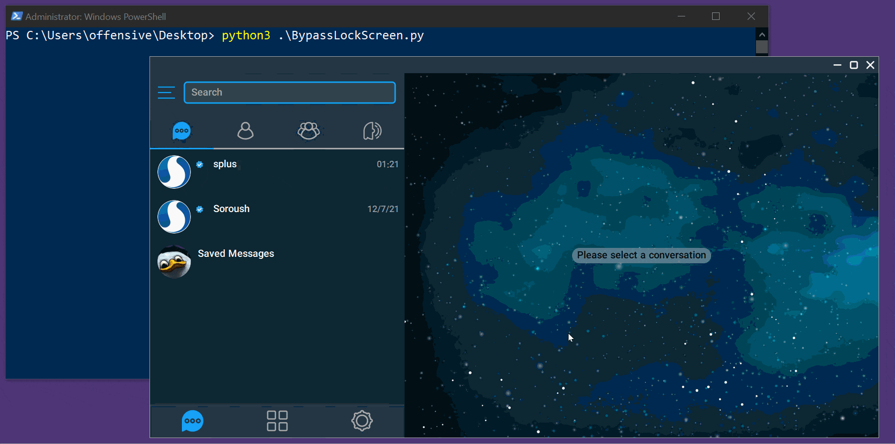

# Lock Screen Bypass

## CVE-2022-26629

### Affected Products

- SoroushPlus+ Messenger 1.0.30

### Vulnerability Type

Improper Access Control

### Impact

Lock Screen Bypass

### Summary

Improper handling of insufficient permissions and privileges allows an attacker to modify and overwrite the lock screen functionality causing it to be bypassed without any authorization.

## Exploitation

[BypassLockScreen.py](Lock%20Screen%20Bypass/BypassLockScreen.py)

### Auto Exploit PoC

1. Drop `BypassLockScreen.py` to the your SoroushPlus+ installation directory,
2. Run `Python3 BypassLockScreen.py`.

### **Tested Environments**

- Windows
- Linux

### Demo

